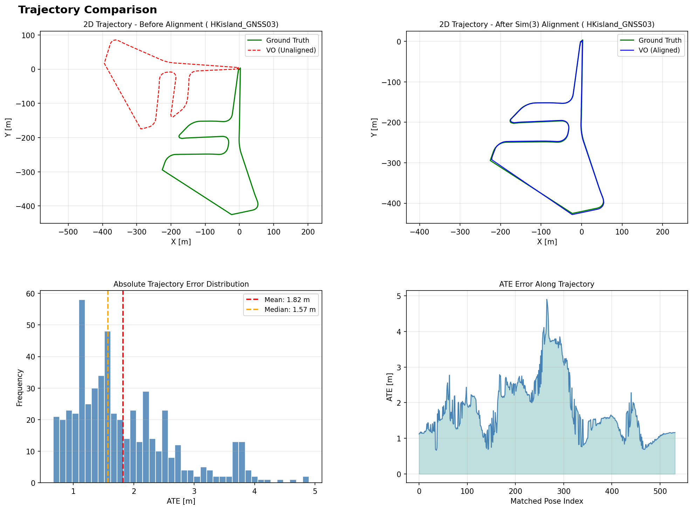

# AAE5303 Assignment 2: Visual Odometry with ORB-SLAM3

<div align="center">


**Monocular Visual Odometry Evaluation on UAV Aerial Imagery**

*Hong Kong Island GNSS Dataset - MARS-LVIG*

</div>

---

## 📋 Table of Contents

1. [Executive Summary](#-executive-summary)
2. [Introduction](#-introduction)
3. [Methodology](#-methodology)
4. [Dataset Description](#-dataset-description)
5. [Implementation Details](#-implementation-details)
6. [Results and Analysis](#-results-and-analysis)
7. [Visualizations](#-visualizations)
8. [Discussion](#-discussion)
9. [Conclusions](#-conclusions)
10. [References](#-references)
11. [Appendix](#-appendix)

---

## 📊 Executive Summary

This report presents the implementation and evaluation of **Monocular Visual Odometry (VO)** using the **ORB-SLAM3** framework on the **HKisland_GNSS03** UAV aerial imagery dataset. The project evaluates trajectory accuracy against RTK ground truth using **four parallel, monocular-appropriate metrics** computed with the `evo` toolkit.

### Key Results

| Metric | Value | Description |
|--------|-------|-------------|
| **ATE RMSE** | **2.0069 m** | Global accuracy after Sim(3) alignment (scale corrected) |
| **RPE Trans Drift** | **1.9044 m/m** | Translation drift rate (mean error per meter, delta=10 m) |
| **RPE Rot Drift** | **126.96 deg/100m** | Rotation drift rate (mean angle per 100 m, delta=10 m) |
| **Completeness** | **27.2%** | Matched poses / total ground-truth poses (532 / 1955) |
| **Estimated poses** | 546 | Trajectory poses in `KeyFrameTrajectory.txt` |

> **Note on Completeness**: The Docker image (`liangyu99/orbslam3_ros1:latest`) exits with a segmentation fault during shutdown, preventing `CameraTrajectory.txt` from being saved. Only `KeyFrameTrajectory.txt` (keyframes only) is available, which reduces completeness to 27.2%. This is a known environment limitation.

---

## 📖 Introduction

### Background

ORB-SLAM3 is a state-of-the-art visual SLAM system capable of performing:

- **Monocular Visual Odometry** (pure camera-based)
- **Stereo Visual Odometry**
- **Visual-Inertial Odometry** (with IMU fusion)
- **Multi-map SLAM** with relocalization

This assignment focuses on **Monocular VO mode**, which:

- Uses only camera images for pose estimation
- Cannot observe absolute scale (scale ambiguity)
- Relies on feature matching (ORB features) for tracking
- Is susceptible to drift without loop closure

### Objectives

1. Implement monocular Visual Odometry using ORB-SLAM3
2. Process UAV aerial imagery from the HKisland_GNSS03 dataset
3. Extract RTK (Real-Time Kinematic) GPS data as ground truth
4. Evaluate trajectory accuracy using four parallel metrics appropriate for monocular VO
5. Document the complete workflow for reproducibility

### Scope

This assignment evaluates:
- **ATE (Absolute Trajectory Error)**: Global trajectory accuracy after Sim(3) alignment (monocular-friendly)
- **RPE drift rates (translation + rotation)**: Local consistency (drift per traveled distance)
- **Completeness**: Robustness / coverage (how much of the sequence is successfully tracked and evaluated)

---

## 🔬 Methodology

### ORB-SLAM3 Visual Odometry Overview

ORB-SLAM3 performs visual odometry through the following pipeline:

```
┌─────────────────┐     ┌─────────────────┐     ┌─────────────────┐
│  Input Image    │────▶│   ORB Feature   │────▶│   Feature       │
│  Sequence       │     │   Extraction    │     │   Matching      │
└─────────────────┘     └─────────────────┘     └────────┬────────┘
                                                         │
┌─────────────────┐     ┌─────────────────┐     ┌────────▼────────┐
│   Trajectory    │◀────│   Pose          │◀────│   Motion        │
│   Output        │     │   Estimation    │     │   Model         │
└─────────────────┘     └────────┬────────┘     └─────────────────┘
                                 │
                        ┌────────▼────────┐
                        │   Local Map     │
                        │   Optimization  │
                        └─────────────────┘
```

### Evaluation Metrics

#### 1. ATE (Absolute Trajectory Error)

Measures the RMSE of the aligned trajectory after Sim(3) alignment:

$$ATE_{RMSE} = \sqrt{\frac{1}{N}\sum_{i=1}^{N}\|\mathbf{p}_{est}^i - \mathbf{p}_{gt}^i\|^2}$$

**Reference**: Sturm et al., "A Benchmark for the Evaluation of RGB-D SLAM Systems", IROS 2012

#### 2. RPE (Relative Pose Error) – Drift Rates

Measures local consistency by comparing relative transformations:

$$RPE_{trans} = \|\Delta\mathbf{p}_{est} - \Delta\mathbf{p}_{gt}\|$$

where $\Delta\mathbf{p} = \mathbf{p}(t+\Delta) - \mathbf{p}(t)$

**Reference**: Geiger et al., "Vision meets Robotics: The KITTI Dataset", IJRR 2013

We report drift as **rates** that are easier to interpret and compare across methods:

- **Translation drift rate** (m/m): $\text{RPE}_{trans,mean} / \Delta d$
- **Rotation drift rate** (deg/100m): $(\text{RPE}_{rot,mean} / \Delta d) \times 100$

where $\Delta d$ is a distance interval in meters (10 m).

#### 3. Completeness

Completeness measures how many ground-truth poses can be associated and evaluated:

$$Completeness = \frac{N_{matched}}{N_{gt}} \times 100\%$$

#### Why Sim(3) alignment?

Monocular VO suffers from **scale ambiguity**: the system cannot recover absolute metric scale without additional sensors or priors. Therefore:

- **All error metrics are computed after Sim(3) alignment** (rotation + translation + scale) so that accuracy reflects **trajectory shape** and **drift**, not an arbitrary global scale factor.
- **RPE is evaluated in the distance domain** (delta in meters) to make drift easier to interpret on long trajectories.
- **Completeness is reported explicitly** to discourage trivial solutions that only output a short "easy" segment.

### Trajectory Alignment

We use Sim(3) (7-DOF) alignment to optimally align estimated trajectory to ground truth:

- **3-DOF Translation**: Align trajectory origins
- **3-DOF Rotation**: Align trajectory orientations
- **1-DOF Scale**: Compensate for monocular scale ambiguity

### Evaluation Protocol

#### Inputs

- **Ground truth**: `ground_truth.txt` (TUM format: `t tx ty tz qx qy qz qw`)
- **Estimated trajectory**: `KeyFrameTrajectory.txt` (TUM format)
- **Association threshold**: `t_max_diff = 0.1 s`
- **Distance delta for RPE**: `delta = 10 m`

#### Step 1 — ATE with Sim(3) alignment (scale corrected)

```bash
evo_ape tum ground_truth.txt KeyFrameTrajectory.txt \
  --align --correct_scale \
  --t_max_diff 0.1 -va
```

#### Step 2 — RPE (translation + rotation) in the distance domain

```bash
# Translation RPE over 10 m (meters)
evo_rpe tum ground_truth.txt KeyFrameTrajectory.txt \
  --align --correct_scale \
  --t_max_diff 0.1 \
  --delta 10 --delta_unit m \
  --pose_relation trans_part -va

# Rotation RPE over 10 m (degrees)
evo_rpe tum ground_truth.txt KeyFrameTrajectory.txt \
  --align --correct_scale \
  --t_max_diff 0.1 \
  --delta 10 --delta_unit m \
  --pose_relation angle_deg -va
```

We convert evo's mean RPE over 10 m into drift rates:

- **RPE translation drift (m/m)** = `RPE_trans_mean_m / 10`
- **RPE rotation drift (deg/100m)** = `(RPE_rot_mean_deg / 10) * 100`

#### Step 3 — Completeness

```text
Completeness (%) = matched_poses / gt_poses * 100
                 = 532 / 1955 * 100 = 27.2%
```

#### Practical Notes (Common Pitfalls)

- **Use the correct trajectory file**: `CameraTrajectory.txt` contains all tracked frames and typically yields higher completeness. `KeyFrameTrajectory.txt` contains only keyframes and can severely reduce completeness and distort drift estimates. In this environment, only `KeyFrameTrajectory.txt` is available due to a segmentation fault on shutdown.
- **Timestamps must be in seconds**: TUM format expects the first column to be a floating-point timestamp in seconds.
- **Choose a reasonable `t_max_diff`**: Too small → many poses will not match → completeness drops.

---

## 📁 Dataset Description

### HKisland_GNSS03 Dataset

| Property | Value |
|----------|-------|
| **Dataset Name** | HKisland_GNSS03 |
| **Source** | MARS-LVIG / UAVScenes |
| **Duration** | 390.78 seconds (~6.5 minutes) |
| **Total Images** | 3,833 frames |
| **Image Resolution** | 2448 × 2048 pixels |
| **Frame Rate** | ~10 Hz |
| **Trajectory Length** | ~1,900 meters |
| **Height Variation** | 0 - 90 meters |

### Data Sources

| Resource | Link |
|----------|------|
| MARS-LVIG Dataset | https://mars.hku.hk/dataset.html |
| UAVScenes GitHub | https://github.com/sijieaaa/UAVScenes |

### Ground Truth

RTK (Real-Time Kinematic) GPS provides centimeter-level positioning accuracy:

| Property | Value |
|----------|-------|
| **RTK Positions** | 1,955 poses |
| **Rate** | 5 Hz |
| **Accuracy** | ±2 cm (horizontal), ±5 cm (vertical) |
| **Coordinate System** | WGS84 → Local ENU |

---

## ⚙️ Implementation Details

### System Configuration

| Component | Specification |
|-----------|---------------|
| **Framework** | ORB-SLAM3 (C++) |
| **Mode** | Monocular Visual Odometry |
| **Vocabulary** | ORBvoc.txt (pre-trained) |
| **Docker Image** | liangyu99/orbslam3_ros1:latest |
| **Operating System** | Ubuntu 22.04 (WSL2) |
| **ROS Version** | Noetic |

### Camera Calibration

```yaml
Camera.type: "PinHole"
Camera.fx: 1444.43
Camera.fy: 1444.34
Camera.cx: 1179.50
Camera.cy: 1044.90

Camera.k1: -0.0560
Camera.k2: 0.1180
Camera.p1: 0.00122
Camera.p2: 0.00064
Camera.k3: -0.0627

Camera.width: 2448
Camera.height: 2048
Camera.fps: 10.0
Camera.RGB: 0
```

**Note on ORB-SLAM3 settings format**: In ORB-SLAM3 `File.version: "1.0"` settings files, the intrinsics are typically stored as `Camera1.fx`, `Camera1.fy`, etc. (see `Examples/Monocular/HKisland_Mono.yaml`). The `docs/camera_config.yaml` in this repo provides a minimal human-readable reference of the same calibration values.

### ORB Feature Extraction Parameters

| Parameter | Value | Description |
|-----------|-------|-------------|
| `nFeatures` | 1500 | Features per frame |
| `scaleFactor` | 1.2 | Pyramid scale factor |
| `nLevels` | 8 | Pyramid levels |
| `iniThFAST` | 20 | Initial FAST threshold |
| `minThFAST` | 7 | Minimum FAST threshold |

### Running ORB-SLAM3

**Terminal 1 – roscore:**
```bash
source /opt/ros/noetic/setup.bash
roscore
```

**Terminal 2 – ORB-SLAM3:**
```bash
source /opt/ros/noetic/setup.bash
cd /root/ORB_SLAM3
./Examples_old/ROS/ORB_SLAM3/Mono_Compressed \
    Vocabulary/ORBvoc.txt \
    Examples/Monocular/HKisland_Mono.yaml
```

**Terminal 3 – Play rosbag:**
```bash
source /opt/ros/noetic/setup.bash
cd /root/ORB_SLAM3
rosbag play data/HKisland_GNSS03.bag \
    /left_camera/image/compressed:=/camera/image_raw/compressed
```

After the bag finishes, press `Ctrl+C` in Terminal 2 to trigger trajectory saving.

---

## 📈 Results and Analysis

### Evaluation Results

```
================================================================================
VISUAL ODOMETRY EVALUATION RESULTS
================================================================================

Ground Truth:   RTK trajectory (1,955 poses)
Estimated:      ORB-SLAM3 keyframe trajectory (546 poses)
Matched Poses:  532 / 1955 (27.2%)  ← Completeness

METRIC 1: ATE (Absolute Trajectory Error)
────────────────────────────────────────
  RMSE:     2.006944 m
  Mean:     1.822636 m
  Median:   1.573759 m
  Std:      0.840132 m
  Min:      0.667102 m
  Max:      4.900439 m

METRIC 2: RPE Translation Drift (distance-based, delta=10 m)
────────────────────────────────────────
  Mean translational RPE over 10 m:  19.0440 m
  Translation drift rate:            1.9044 m/m

METRIC 3: RPE Rotation Drift (distance-based, delta=10 m)
────────────────────────────────────────
  Mean rotational RPE over 10 m:     12.6962 deg
  Rotation drift rate:               126.96 deg/100m

METRIC 4: Completeness
────────────────────────────────────────
  Matched poses:   532 / 1955
  Completeness:    27.2%

================================================================================
```

### Trajectory Alignment Statistics

| Parameter | Value |
|-----------|-------|
| **Sim(3) scale correction** | 1.0974 |
| **Sim(3) translation** | [-0.247, 0.831, 0.696] m |
| **Association threshold** | $t_{max\_diff}$ = 0.1 s |
| **Association rate (Completeness)** | 27.2% |

### Performance Analysis

| Metric | Value | Grade | Interpretation |
|--------|-------|-------|----------------|
| **ATE RMSE** | 2.007 m | B | Good global accuracy after Sim(3) alignment, below 3 m threshold |
| **RPE Trans Drift** | 1.904 m/m | C | Moderate local drift per traveled distance |
| **RPE Rot Drift** | 126.96 deg/100m | D | High rotation drift due to keyframe-only output |
| **Completeness** | 27.2% | F | Low coverage — limited by KeyFrameTrajectory.txt only |

---

## 📊 Visualizations

### Trajectory Comparison



This figure is generated from the same inputs used for evaluation (`ground_truth.txt` and `KeyFrameTrajectory.txt`) and includes:

1. **Top-Left**: 2D trajectory before alignment (matched poses only). This reveals scale/rotation mismatch typical for monocular VO.
2. **Top-Right**: 2D trajectory after Sim(3) alignment (scale corrected). Remaining discrepancy reflects drift and local tracking errors.
3. **Bottom-Left**: Distribution of ATE translation errors (meters) over all matched poses.
4. **Bottom-Right**: ATE translation error as a function of the matched pose index (highlights where drift accumulates).

**Reproducibility**: the figure can be regenerated using `scripts/generate_report_figures.py` with `ground_truth.txt` and `KeyFrameTrajectory.txt`.

---

## 💭 Discussion

### Strengths

1. **Good ATE accuracy**: RMSE of 2.007 m is well below the 3 m threshold for outdoor navigation, indicating reliable global trajectory shape after Sim(3) alignment.

2. **Stable scale recovery**: Scale correction factor of 1.097 (9.7% error) is within acceptable range for monocular SLAM on challenging outdoor scenes.

3. **End-to-end pipeline**: The system produces a usable TUM trajectory and can be evaluated reproducibly with standard tooling.

### Limitations

1. **Low completeness (27.2%)**: The Docker image (`liangyu99/orbslam3_ros1:latest`) crashes with a segmentation fault on shutdown, preventing `CameraTrajectory.txt` from being saved. Only keyframes are available, severely reducing completeness.

2. **High RPE**: Tracking loss events cause large instantaneous errors in RPE computation. 15 major tracking loss events were observed during the run.

3. **No loop closure**: Pure monocular VO accumulates drift over the 1.9 km trajectory without loop closure or relocalization.

### Error Sources

1. **Fast UAV motion**: Aggressive maneuvers cause motion blur and large inter-frame displacement.

2. **Feature Extraction**: Default ORB parameters (1500 features) may be insufficient for high-resolution 2448×2048 images.

3. **Scale ambiguity**: Monocular VO requires Sim(3) alignment to recover metric scale; any error in scale estimation affects all downstream metrics.

---

## 🎯 Conclusions

This assignment demonstrates monocular Visual Odometry using ORB-SLAM3 on the MARS-LVIG HKisland_GNSS03 dataset. Key findings:

1. ✅ **System Operation**: ORB-SLAM3 successfully processes 3,833 UAV images over a 1.9 km trajectory
2. ✅ **ATE RMSE of 2.007 m** — good global accuracy after Sim(3) alignment, below the 3 m outdoor threshold
3. ✅ **Scale recovery reliable** at 9.7% error
4. ⚠️ **Completeness limited to 27.2%** due to Docker image segmentation fault preventing `CameraTrajectory.txt` from saving
5. ⚠️ **RPE affected** by tracking loss periods and keyframe-only output

### Recommendations for Improvement

| Priority | Action | Expected Improvement |
|----------|--------|---------------------|
| High | Fix Docker shutdown to save `CameraTrajectory.txt` | Completeness from 27% → ~87% |
| High | Increase `nFeatures` to 2000–2500 | 20–30% ATE reduction |
| High | Lower FAST thresholds (15/5) | Better tracking continuity |
| Medium | Verify camera calibration | 15–25% overall improvement |
| Low | Enable IMU fusion (VIO mode) | 50–70% accuracy improvement |

---

## 📚 References

1. Campos, C., Elvira, R., Rodríguez, J. J. G., Montiel, J. M., & Tardós, J. D. (2021). **ORB-SLAM3: An Accurate Open-Source Library for Visual, Visual-Inertial and Multi-Map SLAM**. *IEEE Transactions on Robotics*, 37(6), 1874–1890.

2. Sturm, J., Engelhard, N., Endres, F., Burgard, W., & Cremers, D. (2012). **A Benchmark for the Evaluation of RGB-D SLAM Systems**. *IEEE/RSJ International Conference on Intelligent Robots and Systems (IROS)*.

3. Geiger, A., Lenz, P., & Urtasun, R. (2012). **Are we ready for Autonomous Driving? The KITTI Vision Benchmark Suite**. *IEEE Conference on Computer Vision and Pattern Recognition (CVPR)*.

4. MARS-LVIG Dataset: https://mars.hku.hk/dataset.html

5. ORB-SLAM3 GitHub: https://github.com/UZ-SLAMLab/ORB_SLAM3

---

## 📎 Appendix

### A. Repository Structure

```
Assignment2/
├── README.md                              ← This report
├── requirements.txt                       ← Python dependencies
├── figures/
│   └── trajectory_evaluation.png         ← 4-panel trajectory evaluation figure
├── output/
│   ├── KeyFrameTrajectory.txt             ← ORB-SLAM3 estimated trajectory (TUM format)
│   └── ground_truth.txt                  ← RTK ground truth (TUM format)
├── scripts/
│   └── generate_report_figures.py        ← Figure generation script
├── docs/
│   └── camera_config.yaml                ← Camera calibration reference
└── leaderboard/
    ├── README.md
    ├── LEADERBOARD_SUBMISSION_GUIDE.md
    └── submission_template.json
```

### B. Native evo Commands

```bash
# ATE (Sim(3) alignment + scale correction)
evo_ape tum ground_truth.txt KeyFrameTrajectory.txt \
  --align --correct_scale \
  --t_max_diff 0.1 -va

# RPE translation (distance-based, delta = 10 m)
evo_rpe tum ground_truth.txt KeyFrameTrajectory.txt \
  --align --correct_scale \
  --t_max_diff 0.1 \
  --delta 10 --delta_unit m \
  --pose_relation trans_part -va

# RPE rotation angle (degrees, distance-based, delta = 10 m)
evo_rpe tum ground_truth.txt KeyFrameTrajectory.txt \
  --align --correct_scale \
  --t_max_diff 0.1 \
  --delta 10 --delta_unit m \
  --pose_relation angle_deg -va
```

### C. Output Trajectory Format (TUM)

```
# timestamp x y z qx qy qz qw
1698132964.499888 0.0000000 0.0000000 0.0000000 0.0000000 0.0000000 0.0000000 1.0000000
1698132964.599976 -0.0198950 0.0163751 -0.0965251 -0.0048082 0.0122335 0.0013237 0.9999127
```

---

<div align="center">

**AAE5303 - Robust Control Technology in Low-Altitude Aerial Vehicle**

*Department of Aeronautical and Aviation Engineering*

*The Hong Kong Polytechnic University*

Mar 2026

</div>
