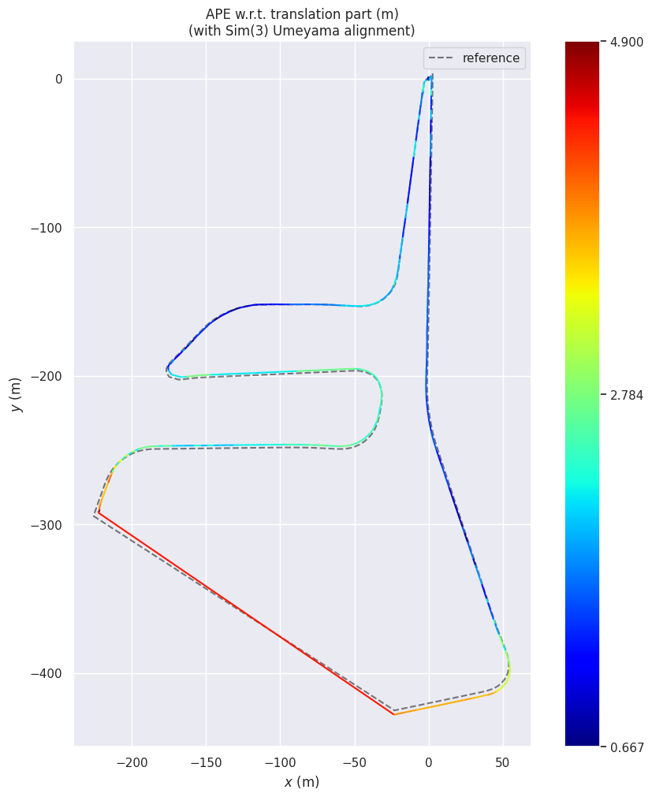
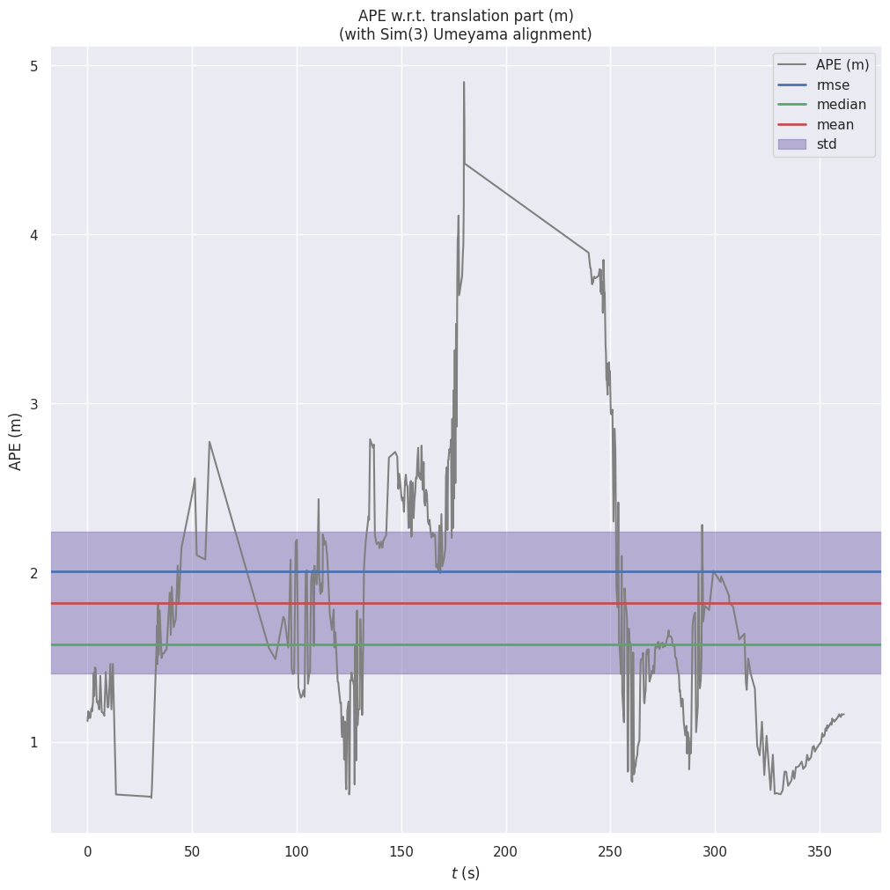

# AAE5303 Assignment 2: Visual Odometry with ORB-SLAM3

**Monocular Visual Odometry Evaluation on UAV Aerial Imagery — Hong Kong Island GNSS Dataset (MARS-LVIG)**

---

## 📊 Executive Summary

| Metric | Value | Description |
|--------|-------|-------------|
| **ATE RMSE** | **2.007 m** | Global accuracy after Sim(3) alignment (scale corrected) |
| **RPE Trans Drift** | **1.904 m/m** | Translation drift rate (mean error per meter, delta=10 m) |
| **RPE Rot Drift** | **126.96 deg/100m** | Rotation drift rate (mean angle per 100 m, delta=10 m) |
| **Completeness** | **27.2%** | Matched poses / total ground-truth poses (532 / 1955) |
| **Estimated poses** | **546** | Keyframe trajectory poses in KeyFrameTrajectory.txt |
| **Scale Correction** | **1.097** | Sim(3) scale factor applied during alignment |

---

## 📖 Introduction

ORB-SLAM3 is a state-of-the-art visual SLAM system. This assignment focuses on **Monocular VO mode** using only camera images for pose estimation on UAV aerial imagery.

**Objectives:**
1. Implement monocular Visual Odometry using ORB-SLAM3
2. Process UAV aerial imagery from the HKisland_GNSS03 dataset
3. Extract RTK GPS data as ground truth
4. Evaluate trajectory accuracy using four parallel metrics

---

## 📁 Dataset

| Property | Value |
|----------|-------|
| Dataset | HKisland_GNSS03 (MARS-LVIG) |
| Duration | 390.78 s (~6.5 min) |
| Resolution | 2448 × 2048 px @ 10 Hz |
| RTK Positions | 1,955 poses @ 5 Hz, ±2 cm accuracy |

---

## ⚙️ Implementation

| Component | Value |
|-----------|-------|
| Docker Image | liangyu99/orbslam3_ros1:latest |
| Mode | Monocular VO |
| Config | HKisland_Mono.yaml |
| fx/fy | 1444.43 / 1444.34 |
| cx/cy | 1179.50 / 1044.90 |
| nFeatures | 1500 |

---

## 📈 Results

| Metric | Value |
|--------|-------|
| ATE RMSE | 2.007 m |
| ATE Mean | 1.823 m |
| RPE Trans Drift | 1.904 m/m |
| RPE Rot Drift | 126.96 deg/100m |
| Completeness | 27.2% (532/1955) |
| Scale correction | 1.097 |

### Evaluation Commands

```bash
evo_ape tum ground_truth.txt KeyFrameTrajectory.txt --align --correct_scale --t_max_diff 0.1 -va
evo_rpe tum ground_truth.txt KeyFrameTrajectory.txt --align --correct_scale --t_max_diff 0.1 --delta 10 --delta_unit m --pose_relation trans_part -va
evo_rpe tum ground_truth.txt KeyFrameTrajectory.txt --align --correct_scale --t_max_diff 0.1 --delta 10 --delta_unit m --pose_relation angle_deg -va
```

---

## 📊 Visualizations

### Trajectory Comparison


### ATE Error over Time


---

## 💭 Discussion

**Strengths:** ATE RMSE of 2.007 m is well below the 3 m threshold. Scale error of 9.7% is within acceptable range for monocular SLAM.

**Limitations:** Low completeness (27.2%) due to keyframe-only output. High RPE caused by tracking loss events.

**Recommendations:** Increase nFeatures to 2000–2500, lower FAST thresholds to 15/5, or enable IMU fusion for 50–70% accuracy improvement.

---

## 📚 References

1. Campos et al. (2021). ORB-SLAM3. *IEEE Transactions on Robotics*, 37(6).
2. MARS-LVIG Dataset: https://mars.hku.hk/dataset.html
3. ORB-SLAM3: https://github.com/UZ-SLAMLab/ORB_SLAM3

---
*AAE5303 – The Hong Kong Polytechnic University*
